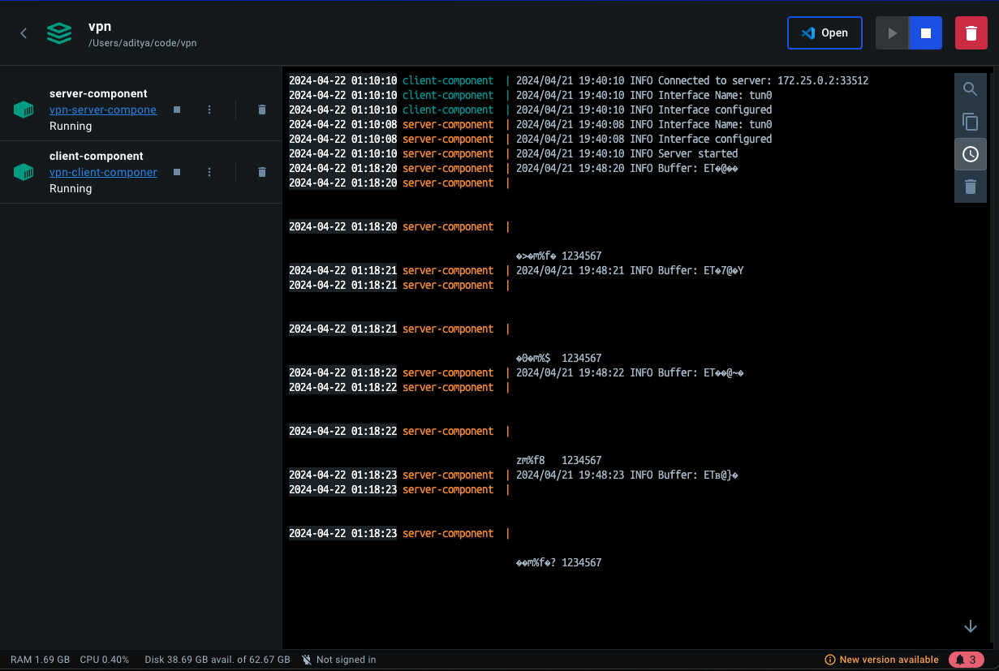

# Mini-tailscale

This is a minimalistic tailscale-like VPN server. It is designed to be simple to deploy and use, and only made for demonstration purposes.

## Tech

### Assumptions

1. All devices in the network need to be connected and discoverable to each other
2. All of them should have a random IP address assigned to them (This would actually mean DNS implementation akin to MagicDNS)
3. There should be one device randomly selected as exit node (This cannot be random, and even Tailscale doesn’t do this randomly

### Tech Decisions for Stack

1. Golang for CLI and VPN implementation
2. Redis instance from Upstash

### Limitations

1. While this implementation can be even more robust by allowing every traffic on the internet to be connected through the exit node, it was not possible to test this on my local system. This is because the system I am using is a VM and I cannot change the network settings to allow all the traffic to go through the exit node.
2. This only works on Linux variants. The main reason for this being TUN device setup is different for different systems. Especially for MacOS, support for TUN is very low.
3. I would have ideally used something like wireguard-go to implement the proper VPN tunnel with added security, but due to task requirements, I did not implement it using wireguard-go.
4. The system is not scalable. This is because the system is designed to have only one exit node and one client ip. If we want to have multiple exit nodes, we would have to change the implementation to have a more robust system.
5. Only server ip is stored on redis. If there were more than one users for this, and we were allowing visual changes similar to tailscale, we would have to store the client IPs and many other details as well associated with each user.

### How it works

1. The first system creates a VPN server and is the exit node, all other systems connect to this system.
2. Once the first system is up, it will be the exit node and advertise itself
   as such on the redis instance.
3. All other systems will connect to this system and get a random IP address
   assigned to them. They will also be added to the redis instance.

### Reasoning for Redis Instance

Redis instance is a very simple way to store the IP addresses of the devices in
the network. This is to determine the server IP address and whether the device
is an exit node or not.

## How to test on your end?

1. Clone the repository
2. Make sure that docker is up and running
3. Run `make up` on the system
4. You can try either from client end or server end whether the ping goes through for `10.11.12.1/2` or not. If the ping goes successfully, we have our own little VPN Tunnel that connects all the network devices where the server acts as exit node.

## Inspirations and Readings Done

1. [OpenVPN How to Guide](https://openvpn.net/community-resources/how-to/)
2. [Tailscale](https://tailscale.com/)
3. [Wireguard](https://www.wireguard.com/)
4. [Fly.io Blogpost on Wireguard](https://fly.io/blog/our-user-mode-wireguard-year/)

